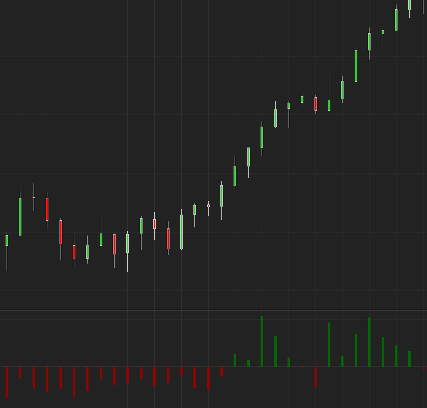

# VOLMA Delta

    

Histogram showing the difference between a fast and slower VOLMA. Positive values mean increasing short-term volume.
For usage, you can download the zip in the release page. You can import this zip file similar to importing a normal NinjaTrader Add-On. https://github.com/WaleeTheRobot/volma-delta/releases
